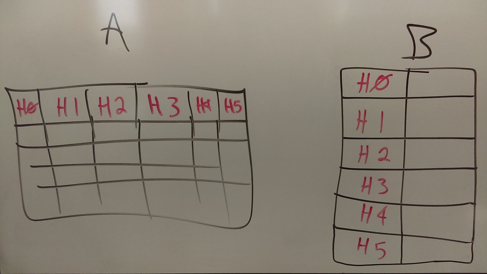

# HTML to JSON


Convert html and/or html tables to json. There is a testing/debugging interface [here](https://hub.mybinder.org/user/fhightower-html-to-json-hxbqunjo/tree).

## Installation

```
pip install html-to-json
```

## Usage

### HTML to JSON

```python
import html_to_json

html_string = """<head>
    <title>Test site</title>
    <meta charset="UTF-8"></head>"""
output_json = html_to_json.convert(html_string)
print(output_json)
```

When calling the `html_to_json.convert` function, you can choose to not capture the text values from the html by passing in the key-word argument `capture_element_values=False`. You can also choose to not capture the attributes of the elements by passing `capture_element_attributes=False` into the function.

#### Example

Example input:

```html
<head>
    <title>Floyd Hightower's Projects</title>
    <meta charset="UTF-8">
    <meta name="description" content="Floyd Hightower&#39;s Projects">
    <meta name="keywords" content="projects,fhightower,Floyd,Hightower">
</head>
```

Example output:

```json
{
    "head": [
    {
        "title": [
        {
            "_value": "Floyd Hightower\'s Projects"
        }],
        "meta": [
        {
            "_attributes":
            {
                "charset": "UTF-8"
            }
        },
        {
            "_attributes":
            {
                "name": "description",
                "content": "Floyd Hightower\'s Projects"
            }
        },
        {
            "_attributes":
            {
                "name": "keywords",
                "content": "projects,fhightower,Floyd,Hightower"
            }
        }]
    }]
}
```

### HTML Tables to JSON

```python
import html_to_json

html_string = """<table class="table table-striped table-bordered table-hover">
    <tr>
        <th>#</th>
        <th>Malware</th>
        <th>MD5</th>
        <th>Date Added</th>
    </tr>
    
    <tr>
        <td>25548</td>
        <td><a href="/stats/DarkComet/">DarkComet</a></td>
        <td><a href="/config/034a37b2a2307f876adc9538986d7b86">034a37b2a2307f876adc9538986d7b86</a></td>
        <td>July 9, 2018, 6:25 a.m.</td>
    </tr>
    
    <tr>
        <td>25547</td>
        <td><a href="/stats/DarkComet/">DarkComet</a></td>
        <td><a href="/config/706eeefbac3de4d58b27d964173999c3">706eeefbac3de4d58b27d964173999c3</a></td>
        <td>July 7, 2018, 6:25 a.m.</td>
    </tr></table>"""
tables = html_to_json.convert_tables(html_string)
print(tables)
```

Currently, this package can handle tables with the headers in the first row or tables with headers in the first column as depicted below:



#### Example

Example input:

```html
<table class="table table-striped table-bordered table-hover">
    <tr>
        <th>#</th>
        <th>Malware</th>
        <th>MD5</th>
        <th>Date Added</th>
    </tr>
    
    <tr>
        <td>25548</td>
        <td><a href="/stats/DarkComet/">DarkComet</a></td>
        <td><a href="/config/034a37b2a2307f876adc9538986d7b86">034a37b2a2307f876adc9538986d7b86</a></td>
        <td>July 9, 2018, 6:25 a.m.</td>
    </tr>
    
    <tr>
        <td>25547</td>
        <td><a href="/stats/DarkComet/">DarkComet</a></td>
        <td><a href="/config/706eeefbac3de4d58b27d964173999c3">706eeefbac3de4d58b27d964173999c3</a></td>
        <td>July 7, 2018, 6:25 a.m.</td>
    </tr>
</table>
```

Example output:

```json
[
    [
        {
            '#': '25548',
            'Malware': 'DarkComet',
            'MD5': '034a37b2a2307f876adc9538986d7b86',
            'Date Added': 'July 9, 2018, 6:25 a.m.'
        }, {
            '#': '25547',
            'Malware': 'DarkComet',
            'MD5': '706eeefbac3de4d58b27d964173999c3',
            'Date Added': 'July 7, 2018, 6:25 a.m.'
        }
    ]
]
```

## Credits

This package was created with [Cookiecutter](https://github.com/audreyr/cookiecutter) and fhightower's [Python project template](https://github.com/fhightower-templates/python-project-template).
