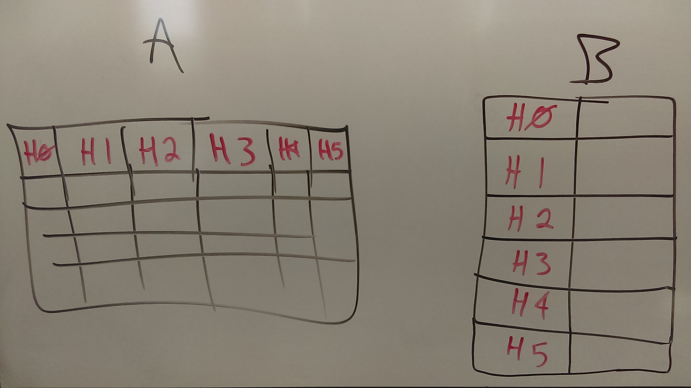

# HTML to JSON

[](https://pypi.python.org/pypi/html-to-json)

[](https://codecov.io/gh/fhightower/html-to-json)

Convert HTML and/or HTML tables to JSON.

👉 **[Try it in your browser](https://fhightower.github.io/html-to-json/)** — the docs site includes an interactive Pyodide-powered playground for both `convert()` and `convert_tables()`.

If this library is useful to you or if you're using this library for a business - please consider [sponsoring](https://github.com/sponsors/fhightower) me. Even a small sponsorship allows me to prioritize work on this library and ongoing maintainance. Thanks!

## Installation

```
pip install html-to-json
```

## Usage

### HTML to JSON

```python
import html_to_json

html_string = """<head>
    <title>Test site</title>
    <meta charset="UTF-8"></head>"""
output_json = html_to_json.convert(html_string)
print(output_json)
```

When calling the `html_to_json.convert` function, you can choose to not capture the text values from the html by passing in the key-word argument `capture_element_values=False`. You can also choose to not capture the attributes of the elements by passing `capture_element_attributes=False` into the function.

#### Example

Example input:

```html
<head>
    <title>Floyd Hightower's Projects</title>
    <meta charset="UTF-8">
    <meta name="description" content="Floyd Hightower&#39;s Projects">
    <meta name="keywords" content="projects,fhightower,Floyd,Hightower">
</head>
```

Example output:

```json
{
    "head": [
    {
        "title": [
        {
            "_value": "Floyd Hightower's Projects"
        }],
        "meta": [
        {
            "_attributes":
            {
                "charset": "UTF-8"
            }
        },
        {
            "_attributes":
            {
                "name": "description",
                "content": "Floyd Hightower's Projects"
            }
        },
        {
            "_attributes":
            {
                "name": "keywords",
                "content": "projects,fhightower,Floyd,Hightower"
            }
        }]
    }]
}
```

### JSON back to HTML

If you've converted HTML to JSON, made some edits to the resulting data, and want to turn it back into HTML, use `json_to_html`:

```python
import html_to_json

data = html_to_json.convert('<div><p>old text</p></div>')
data['div'][0]['p'][0]['_value'] = 'new text'
print(html_to_json.json_to_html(data))
# <div><p>new text</p></div>
```

Text and attribute values are HTML-escaped, list-valued attributes (such as `class`) are space-joined, and HTML5 void elements (`<br>`, `<meta>`, ``, etc.) are rendered without a closing tag.

Round-tripping is not lossless: the JSON representation groups sibling elements by tag name, so the relative order between *different* tags (and between tags and free-floating text captured in `_values`) is not preserved. Text captured in `_value`/`_values` is emitted before any child tags of the same node.

### HTML Tables to JSON

In addition to converting HTML to JSON, this library can also intelligently convert HTML tables to JSON.

Currently, this library can handle three types of tables:

A. Those with [table headers](https://developer.mozilla.org/en-US/docs/Web/HTML/Element/th) in the first row
B. Those with table headers in the first column
C. Those without table headers

Tables of type A and B are diagrammed below:



#### Example

This code:

```python
import html_to_json

html_string = """<table>
    <tr>
        <th>#</th>
        <th>Malware</th>
        <th>MD5</th>
        <th>Date Added</th>
    </tr>

    <tr>
        <td>25548</td>
        <td><a href="/stats/DarkComet/">DarkComet</a></td>
        <td><a href="/config/034a37b2a2307f876adc9538986d7b86">034a37b2a2307f876adc9538986d7b86</a></td>
        <td>July 9, 2018, 6:25 a.m.</td>
    </tr>

    <tr>
        <td>25547</td>
        <td><a href="/stats/DarkComet/">DarkComet</a></td>
        <td><a href="/config/706eeefbac3de4d58b27d964173999c3">706eeefbac3de4d58b27d964173999c3</a></td>
        <td>July 7, 2018, 6:25 a.m.</td>
    </tr></table>"""
tables = html_to_json.convert_tables(html_string)
print(tables)
```

will produce this output:

```json
[
    [
        {
            "#": "25548",
            "Malware": "DarkComet",
            "MD5": "034a37b2a2307f876adc9538986d7b86",
            "Date Added": "July 9, 2018, 6:25 a.m."
        }, {
            "#": "25547",
            "Malware": "DarkComet",
            "MD5": "706eeefbac3de4d58b27d964173999c3",
            "Date Added": "July 7, 2018, 6:25 a.m."
        }
    ]
]
```

#### Preserving nested tags in table cells

By default, `convert_tables()` only captures the *text* of each cell, so nested tags (such as `<a>` elements) and their attributes are dropped. To keep them, pass one of the following keyword arguments:

* `record_html=True` &mdash; capture each cell's inner HTML as a string.
* `record_children=True` &mdash; capture each cell's children as JSON, using the same structure produced by `convert()`.

If both are given, `record_html` takes precedence.

For example, `html_to_json.convert_tables(html_string, record_html=True)` on the table above produces:

```json
[
    [
        {
            "#": "25548",
            "Malware": "<a href=\"/stats/DarkComet/\">DarkComet</a>",
            "MD5": "<a href=\"/config/034a37b2a2307f876adc9538986d7b86\">034a37b2a2307f876adc9538986d7b86</a>",
            "Date Added": "July 9, 2018, 6:25 a.m."
        }, {
            "#": "25547",
            "Malware": "<a href=\"/stats/DarkComet/\">DarkComet</a>",
            "MD5": "<a href=\"/config/706eeefbac3de4d58b27d964173999c3\">706eeefbac3de4d58b27d964173999c3</a>",
            "Date Added": "July 7, 2018, 6:25 a.m."
        }
    ]
]
```

while `html_to_json.convert_tables(html_string, record_children=True)` produces:

```json
[
    [
        {
            "#": [{"_value": "25548"}],
            "Malware": [{"a": [{"_attributes": {"href": "/stats/DarkComet/"}, "_value": "DarkComet"}]}],
            "MD5": [{"a": [{"_attributes": {"href": "/config/034a37b2a2307f876adc9538986d7b86"}, "_value": "034a37b2a2307f876adc9538986d7b86"}]}],
            "Date Added": [{"_value": "July 9, 2018, 6:25 a.m."}]
        }, {
            "#": [{"_value": "25547"}],
            "Malware": [{"a": [{"_attributes": {"href": "/stats/DarkComet/"}, "_value": "DarkComet"}]}],
            "MD5": [{"a": [{"_attributes": {"href": "/config/706eeefbac3de4d58b27d964173999c3"}, "_value": "706eeefbac3de4d58b27d964173999c3"}]}],
            "Date Added": [{"_value": "July 7, 2018, 6:25 a.m."}]
        }
    ]
]
```

## Development

This project uses [uv](https://docs.astral.sh/uv/) for dependency and environment management. Python 3.10+ is required.

```
uv sync
uv run pytest
./scripts/lint.sh
```

## Credits

This package was created with [Cookiecutter](https://github.com/audreyr/cookiecutter) and fhightower's [Python project template](https://github.com/fhightower-templates/python-project-template).
